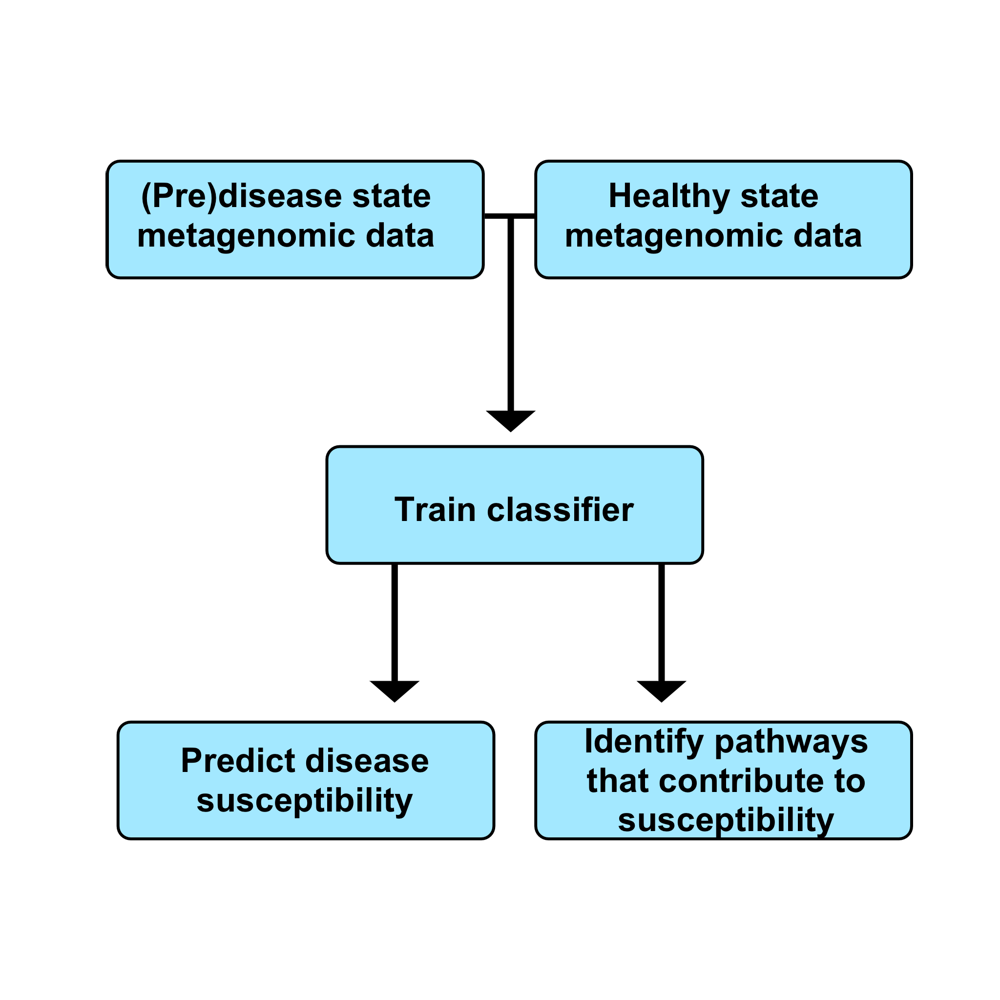
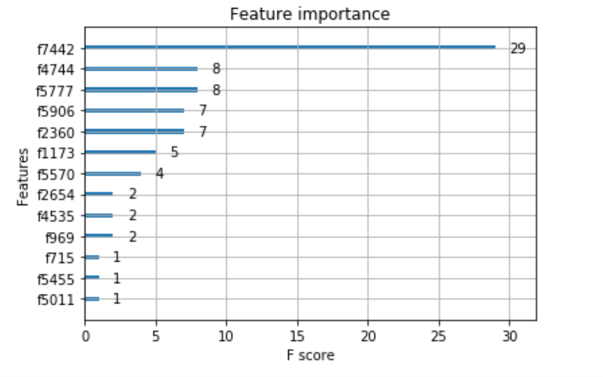

# Prediction of Infection-prone Microbiome Pathways (PrIMP)

## Microbial Communities and Infection

When exposed to similar bacterial challenges, some people get sick and some don't. Antibiotic use disrupts the gut microbiome and significantly increases susceptibility to gastrointestinal infections, suggesting that healthy gut flora play a role in excluding harmful pathogens.

### What's the problem

Currently, the components of the microbiome that determine resistance or susceptibility to infection are not well understood, and streamlined tools for predicting susceptibility are not readily available for researchers or clinicians. Microbiome data, however, is abundant and publicly accessible, making it possible to develop powerful predictive models and identify the biological factors that permit or prevent infection.

### Why should we solve it

If a patient's susceptibility to infection could be predicted from their gut microbiome before they get sick, patients especially vulnerable to hospital-acquired infection could be screened for susceptibility. Furthermore, if the factors in the gut microbiome that make someone resistant to infection can be identified, probiotic therapies could be designed to maintain that resistant state.

## What is PrIMP

PrIMP (Prediction of Infection-prone Microbiome Pathways) is a workflow for predicting disease states from metagenomic data.  Rather than relying solely on taxonomic classification of the species present in the sample, PrIMP examines the molecular pathways present in the microbiome. PrIMP is therefore able to identify specific molecular functions that make the microbiome resistant or susceptible to colonization by a pathogen.

## Software Workflow Diagram

## How to use PrIMP

The user provides a set of 16S DNA sequences from healthy patients and from patients in the disease or pre-disease state the user wants to predict. PrIMP will then generate a predictive model that can classify a patient sample as (pre)disease or healthy.

The Jupyter notebook getOTU.ipynb walks the user through the process of computing the frequencies of each operational taxonomic unit (OTU) and/or each KEGG biological pathway from demultiplexed sequencing data in fastq format.

The Jupyter notebook buildModel.ipynb walks the user through the process of building a model to predict susceptiblity to infection from OTU or KEGG pathway abundances and identifies which OTUs and/or pathways are most predictive of susceptibility.

## Installation options

We provide three options for using PrIMP: installation from Docker, installation from Github, or a publicly accessible Binder.

### DockerFile

PrIMP comes with a Dockerfile for easy building.

  1. `git clone https://github.com/NCBI-Hackathons/PrIMP.git`
  2. `docker build .`
  3. Follow link given by docker in web browser.

### Binder

This repo can be viewed as a JupyterLab Binder (a development environment with all dependencies pre-installed) here:
 or as an R-studio environment [here](https://mybinder.org/v2/gh/NCBI-Hackathons/PrIMP/dc208d4?urlpath=rstudio).

### Example Results

PrIMP was used to analyze the metagenomic 16S sequence dataset generated by a prior study on susceptibility to cholera. Samples of subjects' gut microbiota were sequenced one day after a family member contracted cholera, and then subjects were tracked to see whether they would ultimately catch cholera from their infected family member or not.  [link](https://academic.oup.com/jid/article-abstract/218/4/645/4969495?redirectedFrom=fulltext)

Using the data from this study, PrIMP generated a predictive model to classify individuals as susceptible to cholera or not susceptible. The model had an AUC of 0.78 on the test data set (distinct from training set). The following is a list of the OTUs that are most predictive of susceptbility to infection by Vibrio cholerae as determined by our model.

